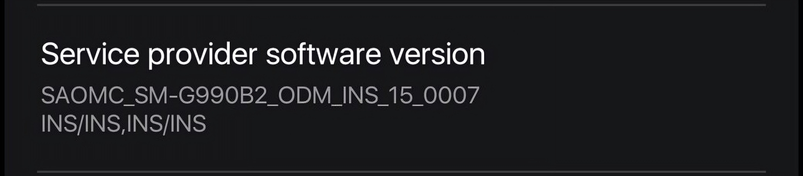

# Modem and bootloader repository
**for Samsung Galaxy S21 FE 5G**

To [download](https://github.com/saadelasfur/proprietary_vendor_samsung_r9x/releases) the correct binaries for your firmware, check your device's model number and your current OMC sales code (ex.  G990B2**ODM**EHYH1):

### Credits
- [@jesec](https://github.com/jesec) and [@corsicanu](https://github.com/corsicanu) for the original GitHub Actions script.
- [@unix3dgforce](https://github.com/unix3dgforce) for his [lpunpack.py](https://github.com/unix3dgforce/lpunpack) script.
